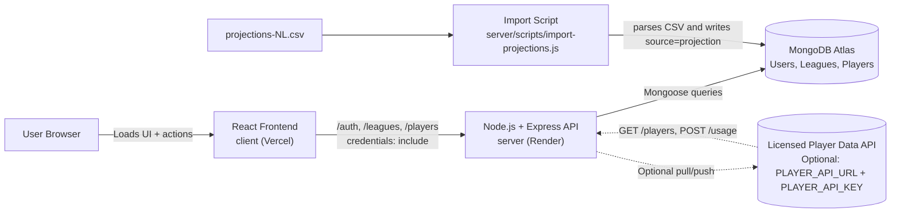
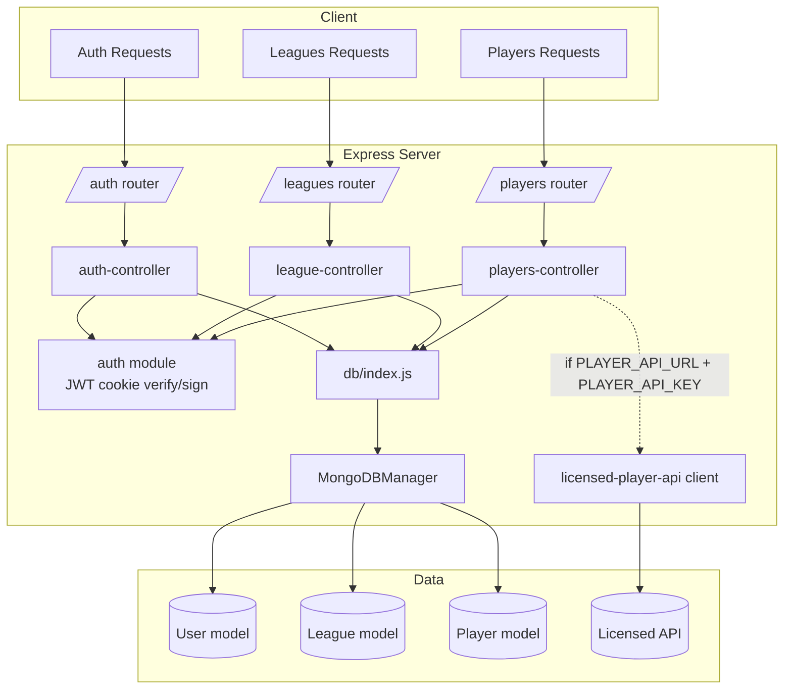
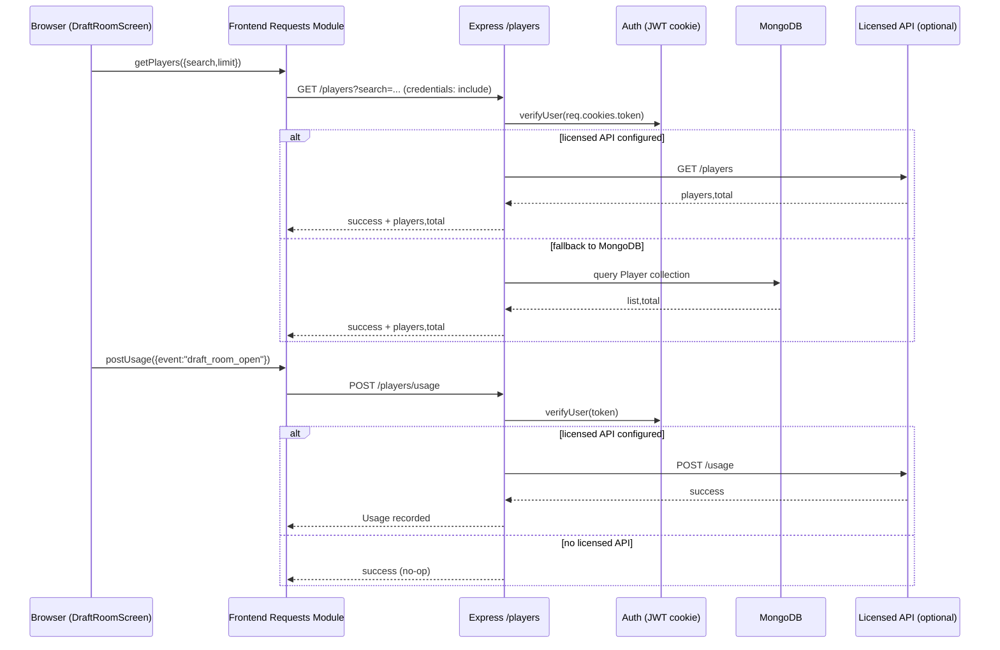

# DraftIQ Architecture Diagram

## 1) System Context

## 2) Backend Layers

## 3) Runtime Request Flow (Draft Room)

## Notes

- Auth is cookie-based JWT (`token` cookie, `credentials: include` from frontend).
- Primary backend endpoints: `/auth`, `/leagues`, `/players`.
- Player source is either local MongoDB (`Player` model) or external licensed API depending on env vars.
