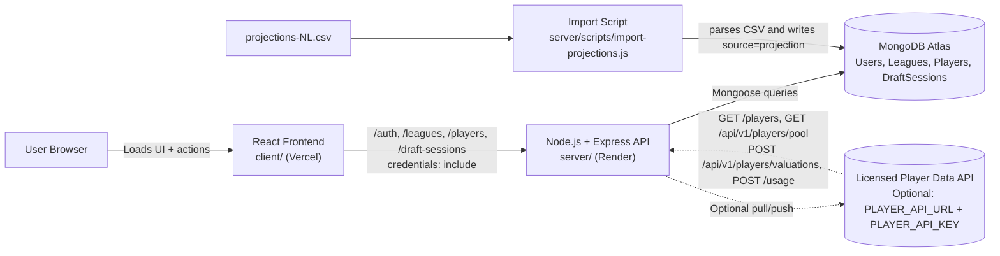
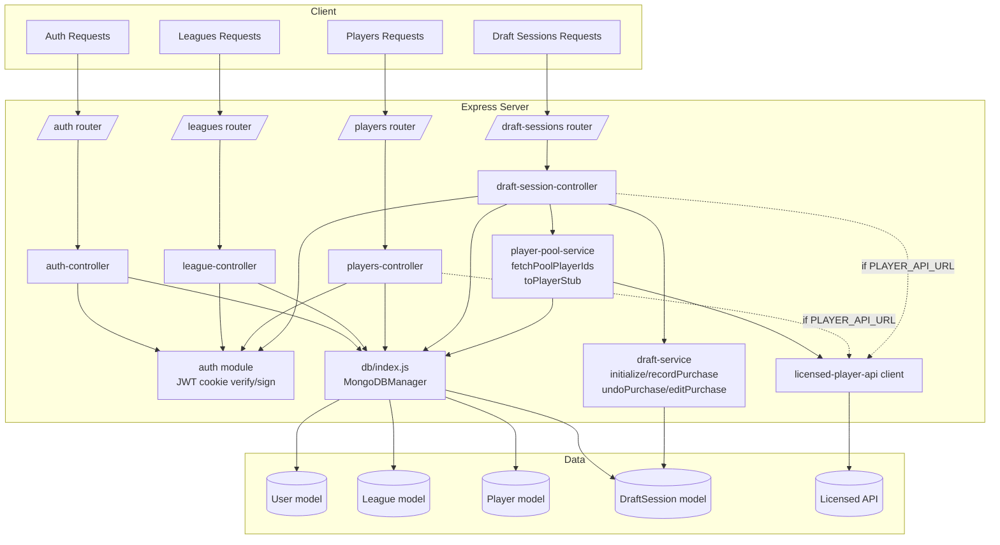
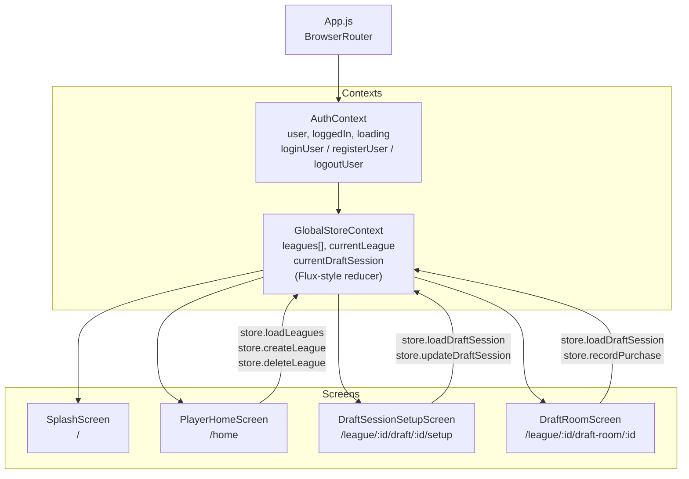
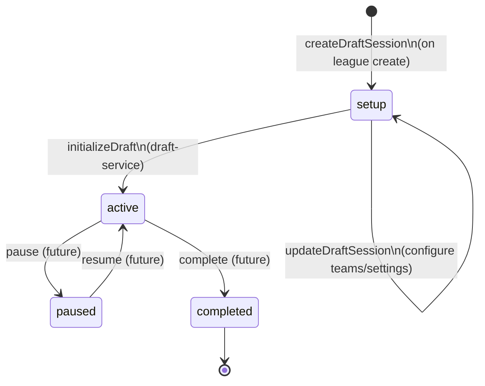
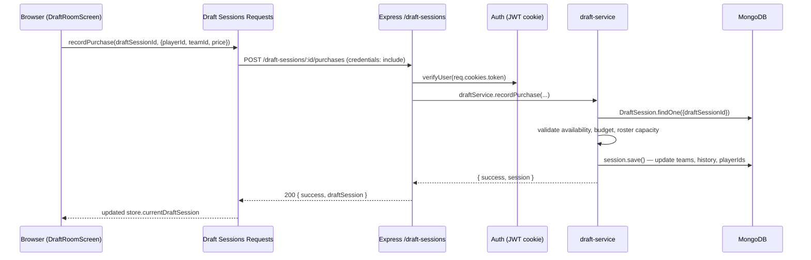
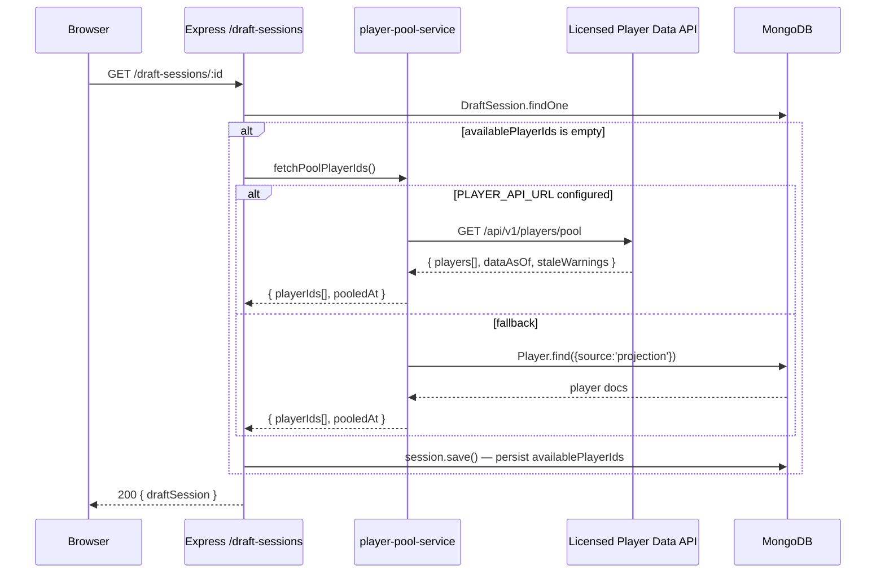

# DraftIQ Architecture Diagram

## 1) System Context

```mermaid
flowchart LR
    U["User Browser"]
    FE["React Frontend\nclient/ (Vercel)"]
    BE["Node.js + Express API\nserver/ (Render)"]
    DB[("MongoDB Atlas\nUsers, Leagues, Players, DraftSessions")]
    API[("Licensed Player Data API\nOptional: PLAYER_API_URL + PLAYER_API_KEY")]
    CSV["projections-NL.csv"]
    IMP["Import Script\nserver/scripts/import-projections.js"]

    U -->|Loads UI + actions| FE
    FE -->|/auth, /leagues, /players, /draft-sessions\ncredentials: include| BE
    BE -->|Mongoose queries| DB

    IMP -->|parses CSV and writes source=projection| DB
    CSV --> IMP

    BE -. Optional pull/push .-> API
    API -. GET /players, GET /api/v1/players/pool\nPOST /api/v1/players/valuations, POST /usage .-> BE
```

## 2) Backend Layers

```mermaid
flowchart TB
    subgraph Client
      C1[Auth Requests]
      C2[Leagues Requests]
      C3[Players Requests]
      C4[Draft Sessions Requests]
    end

    subgraph Server[Express Server]
      R1[/auth router/]
      R2[/leagues router/]
      R3[/players router/]
      R4[/draft-sessions router/]

      AC[auth-controller]
      LC[league-controller]
      PC[players-controller]
      DC[draft-session-controller]

      AU[auth module\nJWT cookie verify/sign]
      DBI[db/index.js\nMongoDBManager]
      DS[draft-service\ninitialize/recordPurchase\nundoPurchase/editPurchase]
      PPS[player-pool-service\nfetchPoolPlayerIds\ntoPlayerStub]
      LAPI[licensed-player-api client]
    end

    subgraph Data
      M1[(User model)]
      M2[(League model)]
      M3[(Player model)]
      M4[(DraftSession model)]
      EXT[(Licensed API)]
    end

    C1 --> R1 --> AC
    C2 --> R2 --> LC
    C3 --> R3 --> PC
    C4 --> R4 --> DC

    AC --> AU
    LC --> AU
    PC --> AU
    DC --> AU

    AC --> DBI --> M1
    LC --> DBI --> M2
    PC --> DBI --> M3
    DC --> DBI --> M4

    DC --> DS
    DC --> PPS
    DS --> M4
    PPS --> LAPI
    PPS --> DBI

    PC -. if PLAYER_API_URL .-> LAPI --> EXT
    DC -. if PLAYER_API_URL .-> LAPI
```

## 3) Client State Management

```mermaid
flowchart TD
    APP["App.js\nBrowserRouter"]

    subgraph Contexts
      AUTH["AuthContext\nuser, loggedIn, loading\nloginUser / registerUser / logoutUser"]
      STORE["GlobalStoreContext\nleagues[], currentLeague\ncurrentDraftSession\n(Flux-style reducer)"]
    end

    subgraph Screens
      S1[SplashScreen\n/]
      S2[PlayerHomeScreen\n/home]
      S3[DraftSessionSetupScreen\n/league/:id/draft/:id/setup]
      S4[DraftRoomScreen\n/league/:id/draft-room/:id]
    end

    APP --> AUTH --> STORE
    STORE --> S1
    STORE --> S2
    STORE --> S3
    STORE --> S4

    S2 -->|store.loadLeagues\nstore.createLeague\nstore.deleteLeague| STORE
    S3 -->|store.loadDraftSession\nstore.updateDraftSession| STORE
    S4 -->|store.loadDraftSession\nstore.recordPurchase| STORE
```

## 4) DraftSession Lifecycle

```mermaid
stateDiagram-v2
    [*] --> setup : createDraftSession\n(on league create)
    setup --> setup : updateDraftSession\n(configure teams/settings)
    setup --> active : initializeDraft\n(draft-service)
    active --> paused : pause (future)
    paused --> active : resume (future)
    active --> completed : complete (future)
    completed --> [*]
```

## 5) Runtime Request Flow (Draft Room — Record Purchase)

```mermaid
sequenceDiagram
    participant B as Browser (DraftRoomScreen)
    participant F as Draft Sessions Requests
    participant S as Express /draft-sessions
    participant A as Auth (JWT cookie)
    participant DS as draft-service
    participant D as MongoDB

    B->>F: recordPurchase(draftSessionId, {playerId, teamId, price})
    F->>S: POST /draft-sessions/:id/purchases (credentials: include)
    S->>A: verifyUser(req.cookies.token)
    S->>DS: draftService.recordPurchase(...)
    DS->>D: DraftSession.findOne({draftSessionId})
    DS->>DS: validate availability, budget, roster capacity
    DS->>D: session.save() — update teams, history, playerIds
    DS-->>S: { success, session }
    S-->>F: 200 { success, draftSession }
    F-->>B: updated store.currentDraftSession
```

## 6) Player Pool Init Flow (GET /draft-sessions/:id)

```mermaid
sequenceDiagram
    participant B as Browser
    participant S as Express /draft-sessions
    participant PPS as player-pool-service
    participant API as Licensed Player Data API
    participant D as MongoDB

    B->>S: GET /draft-sessions/:id
    S->>D: DraftSession.findOne
    alt availablePlayerIds is empty
      S->>PPS: fetchPoolPlayerIds()
      alt PLAYER_API_URL configured
        PPS->>API: GET /api/v1/players/pool
        API-->>PPS: { players[], dataAsOf, staleWarnings }
        PPS-->>S: { playerIds[], pooledAt }
      else fallback
        PPS->>D: Player.find({source:'projection'})
        D-->>PPS: player docs
        PPS-->>S: { playerIds[], pooledAt }
      end
      S->>D: session.save() — persist availablePlayerIds
    end
    S-->>B: 200 { draftSession }
```

## Notes

- Auth is cookie-based JWT (`token` cookie, `credentials: include` from frontend).
- Backend endpoints: `/auth`, `/leagues`, `/players`, `/draft-sessions`.
- Player source is the licensed API when `PLAYER_API_URL + PLAYER_API_KEY` are set; otherwise falls back to local MongoDB `Player` collection (source=`projection`).
- Draft business logic lives in `server/services/draft-service.js` — controllers call the service and serialize the result.
- `DraftSession.availablePlayerIds` is populated lazily on first `GET /draft-sessions/:id` if it is empty (pool not yet fetched).
- The client proxies API requests through Vercel rewrites in production (no `REACT_APP_*` env vars needed for same-domain deploys).
